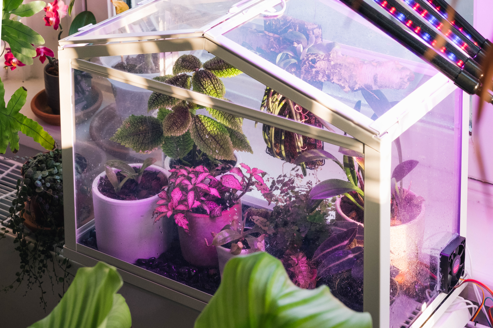

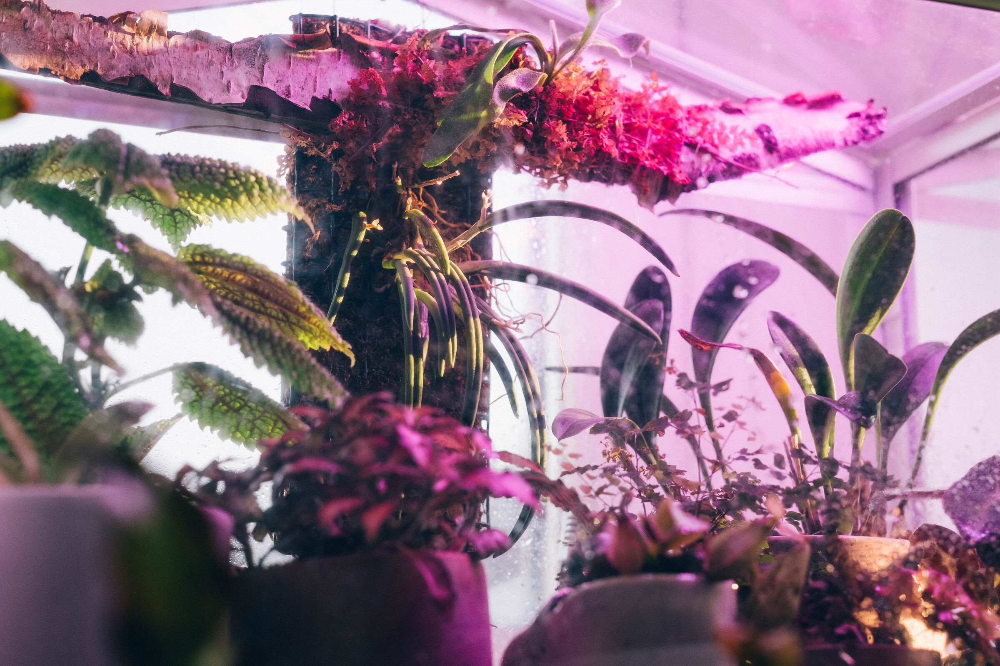

### Enter the orchids

A few months after we moved to The Netherlands in 2020, Alison and I took a trip to a nursery near Hilversum that I had found while searching for horticultural destinations. We rented OV-fietsen from Hilversum Centraal and biked through the Gooi heathlands to [OrchidWubben](https://orchidwubben.com/).

We didn't know what we were in for at the nursery. The greenhouses were attached to a large farmhouse, or, more fairly, the farmhouse was attached to an enormous complex of greenhouses. After being greeted by a family member and wandering on our own for a few minutes through the various climatic zones -- warmer, cooler, drier -- we met [the proprietor](https://www.deondernemer.nl/actueel/topkweker-koos-wubben-84-stopt-pas-als-hij-102-jaar-oud-is~279426?referrer=https%3A%2F%2Fwww.google.com%2F), whose enthusiasm for his collection was clear.

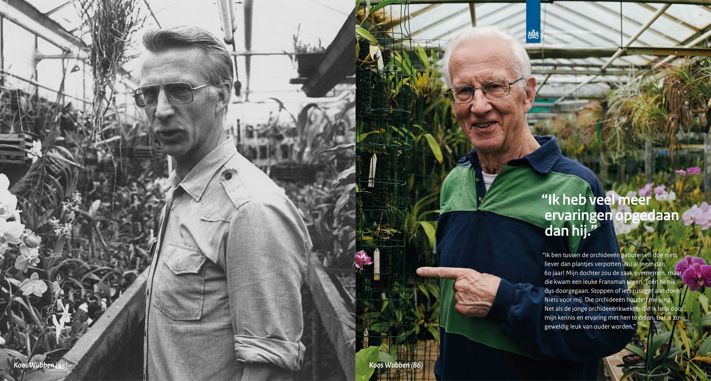

We spent the next two hours getting a guided tour of every nook and cranny of his greenhouses, and learning the stories of their discovery and the intracies of their cultivation. (What we didn't learn then, but I later discovered with a Google Search, was an alleged [1989 prosecution for orchid smuggling in Venezuela](http://www.orchideerotterdam.nl/content/aanb/kwek/abwubben_uk.shtml)!)

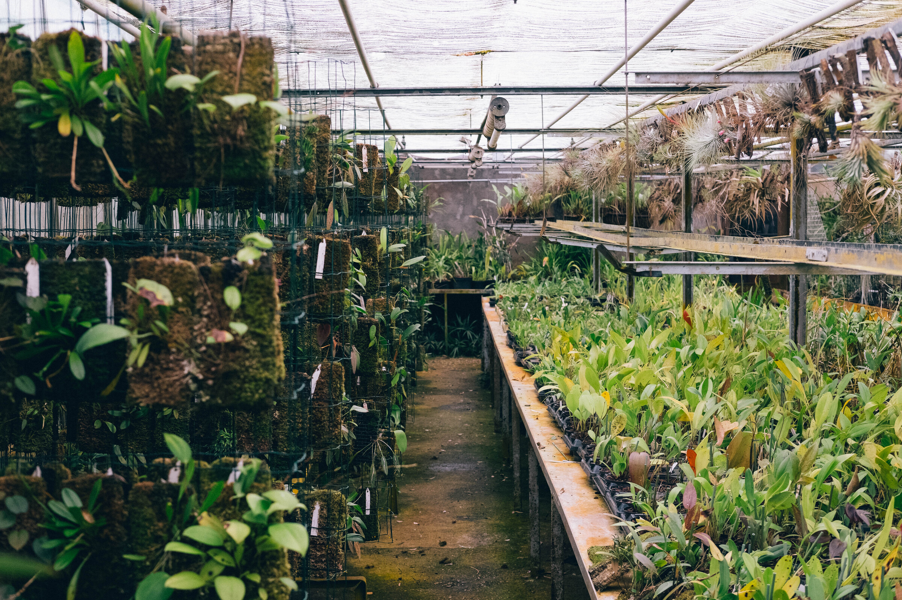
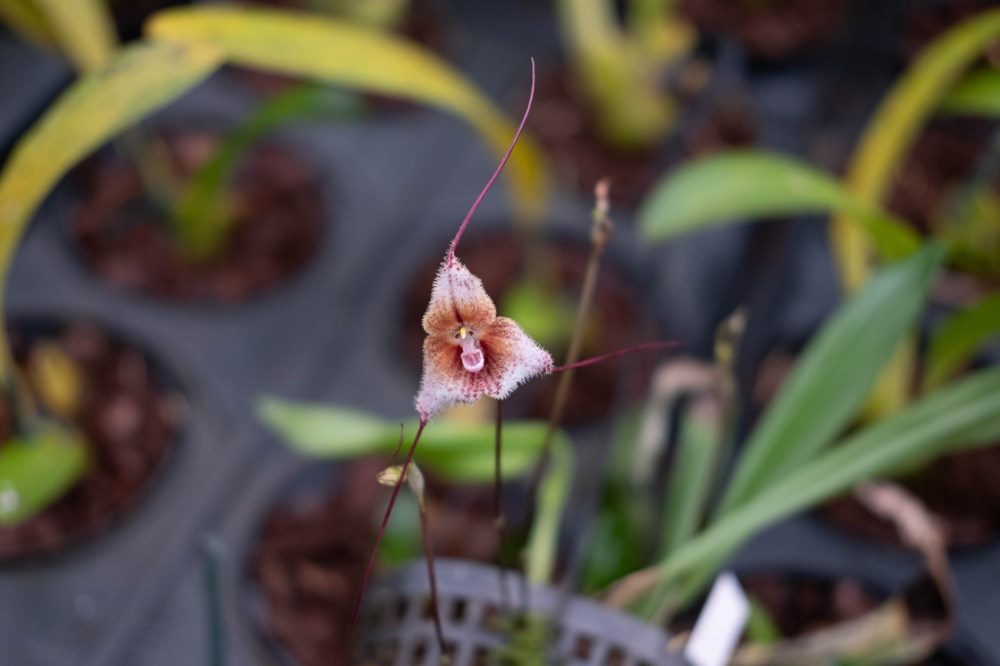

These days, he's a master of propogation and cultivation. He gave us some advice on orchids that wouldn't be 100% certain to die in a typical household interior and I left with a few more than I had originally planned on purchasing. It felt like a lot, but we managed to bungee them all in to the back of our OV-fiets and cycle back to Hilversum Station. (via the amazing Pinetum Blijdenstein)

*Paphiopedilum sukhakulii*, a slipper orchid endemic to mid elevations in Thailand. This plant was about to flower when I purchased it and provided some easy initially joy. (I was warned it needed warm temperatures, but I couldn't resist.)

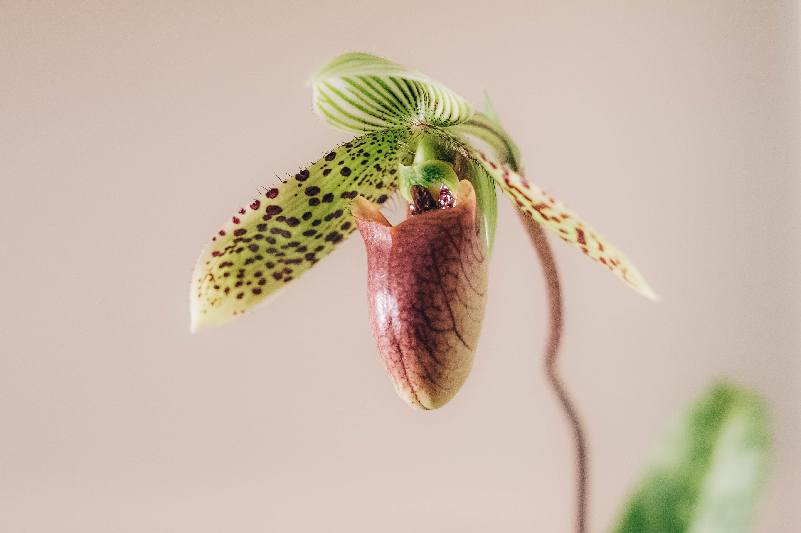

This genus ("Paphs" among fans) is prototypical for problematic obsessions. Newly described species trigger waves of illegal harvesting and smuggling. Wild populations of many species are now quite threatened. However, this particular species is one of the most widely commercially cultivated.

Masdevallia "Flying Colors", a hybrid (*Masdevallia welischii* ✕ (*Masdevallia triangularis* ✕ *Masdevallia veitchiana*)) that was also close to flowering at the time I purchased it.

*Leptotes bicolor*, a South American species with delicate flowers (two colors, as you might guess) that smell faintly of jasmine.

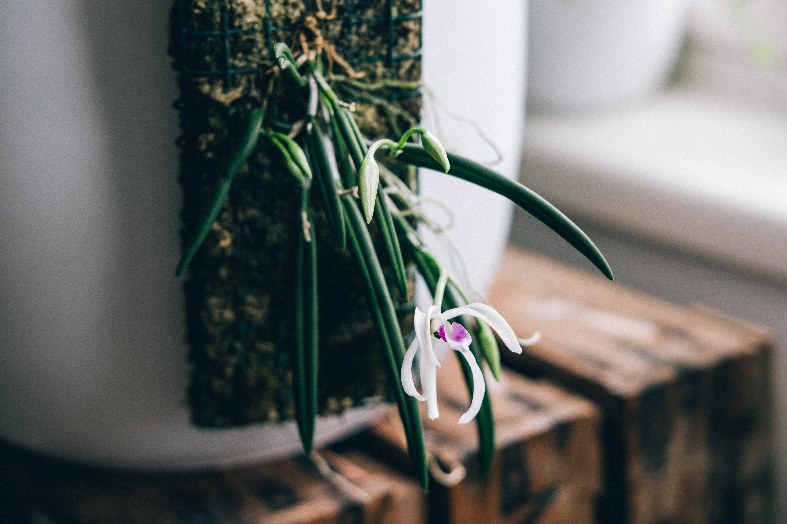

None of these orchids were particularly happy in the subsequent two years. The *Paphiopedilum* and *Masdevallia* had a nice first bloom (one flower each), but I had problems regulating water and they dropped their flowers quickly. The *Leptotes* wasn't near flowering when I purchased it, but put out some flower stalks about half a year later, in the autumn.

The *Paphiopedulum* bloomed again the second year, making it the only one of the orchids to have bloomed twice, which is interesting because of all of them it has the most tropical atmospheric preferences (34º in the summer, and 28º in the winter, at 80% humidity of course.) The *Masdevalia* and *Leptotes* want a summer temperature of more like 28 and a winter temperature around 23.

By contrast, our home, especially near the windows, stays around 16 to 19 degrees in the winter. The summers are variable in the range of 20 to 28 degrees. However, differences between night and day are quite small, and all of these orchids want a large, 6 to 8 degree swing.

A bit more than a year ago, Alison and I were at IKEA and impulse bought [SOCKER](https://www.ikea.com/nl/en/p/socker-greenhouse-white-70186603/), a very inexpensive Wardian-style case. I didn't really have a use case for it at the time, but I figured I'd come up with something. Now, I had.

In the terrarium I could increase the humidity, create greater day-night temperature swings, and keep it warmer in the winter.
In addition to the orchids, I threw in some small suitable plants from the kleine plantjes section at Intratuin. More plants and more soil make maintaining a high humidity easier (though perhaps has some consequenes for ventilation that I will encounter in the summer.) Plus they look nice! 
- *Fittonia albivenis*
- *Platycerium veitchii* — Alison mounted this little staghorn fern very nicely on a piece of birch I found (climatically inappropriate, but looks nice.) We since learned that this is a desert/dry-scrub fern from Australia! Oops, but maybe that's good, since it's difficult to keep mounted plants sufficiently watered.
- *Begonia listada*
- *Adiantum* sp. — A good canary plant for under-watering
- *Pilea involucrata* — Could be smaller

### Building the terrarium

I'm the kind of person that has more than one Raspberry Pi lying around, so I used that for the project, along with a [relay shield](https://elektronicavoorjou.nl/product/raspberry-pi-relais-board/) for switching. This made everything very easy, thanks to existing libraries for the DHT22 temperature and humidity sensor.

I provided ventilation by cutting a small hole in the plexiglass case and gluing a computer fan in place. I positioned it to blow into the case in order to create the most airflow around leaves. It's a 12V fan, but I find it provides plenty of air movement at slower speeds so I just run it off the Raspberry Pi's 5V rail.

Temperature control is provided by small silicone resistive heating mats. I think they're meant for 3D printing beds or something like that -- I just bought them off of AliExpress. These get much hotter than I would want, so I run them at half voltage / quarter power (12V, with its own power supply). I currently only have a single one installed, but I will be adding a second one to better distribute the heat in the terrarium and hopefully reach a slightly higher max daytime temperature.

The heater control is very simple.

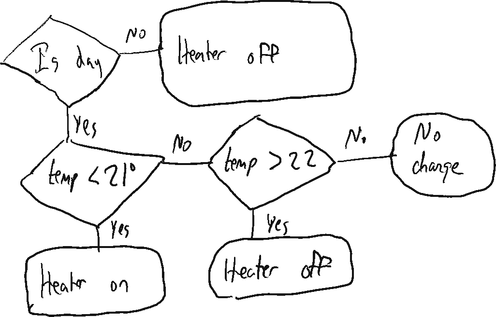

Notice how there's some hysterisis in the on/off set points. In theory this would lead to bigger temperature oscillations, but in practice, because of the thermal capacity of the terrarium and the ceramic planters this works well to ensure that the heater is not rapidly cycling on and off when the temperature is in the target range.

The bottom of the terrarium is filled with pebbles, partially for aesthetic reasons, but I think it also adds some thermal mass that helps better retain and distribute some heat. However, sand would be even better for this and next time I more seriously remodel the interior of the terrarium, I'll probably add a small layer of sand with pebbles inset.

The humidity control is a bit more complicated. It essentially uses the same pattern as above, but attempting to maintin a humidity around 75% during the day and 85% at night. However, while the heater is on, I also want to ensure the fan periodically in order to circulate warm air. So there is another layer to the logic that runs the fan a minimum of 2 minutes every 2 hours.

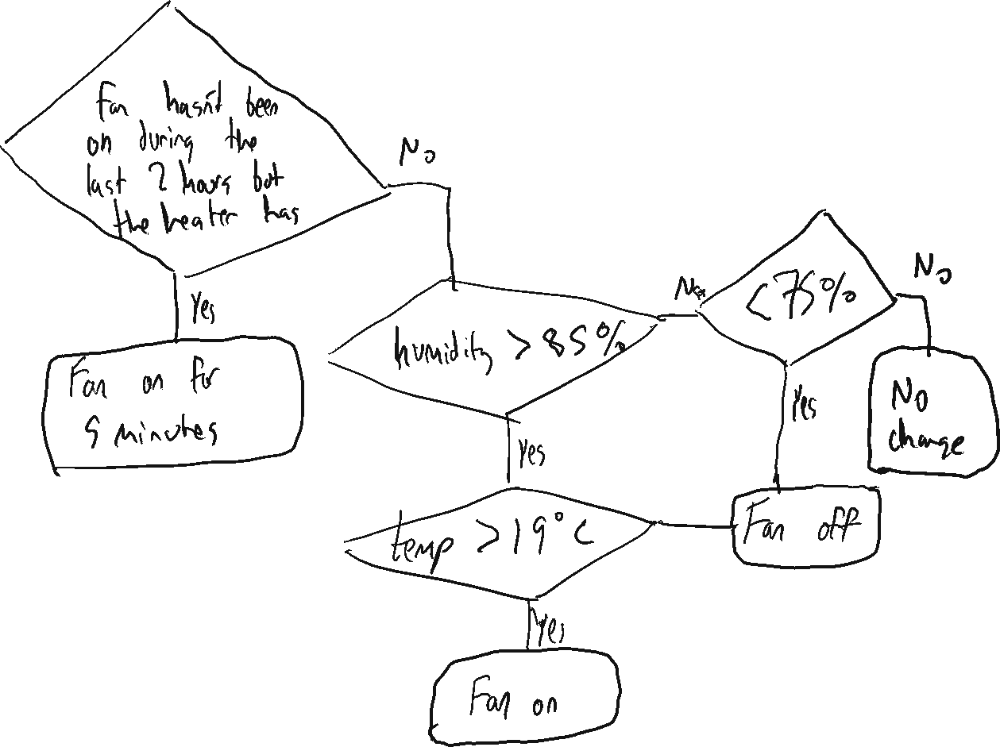

The temperature check should also show a "heater is on" condition — this ignores over-humidity conditions when the terrarium is trying to warm up. This drawing is also slightly out of date, as it has since been complicated with different day/night humidity set points.

There's not a whole lot of theory/modeling behind these control systems. Just [napkin](https://remarkable.com) sketches and some experimentation to find out what works in practice. The system is severely underactuated. Most noticeably, there is no way to directly increase humidity. Increasing the temperature with the heaters and decreasing the temperature with ventilation both tend to decrease humidity.

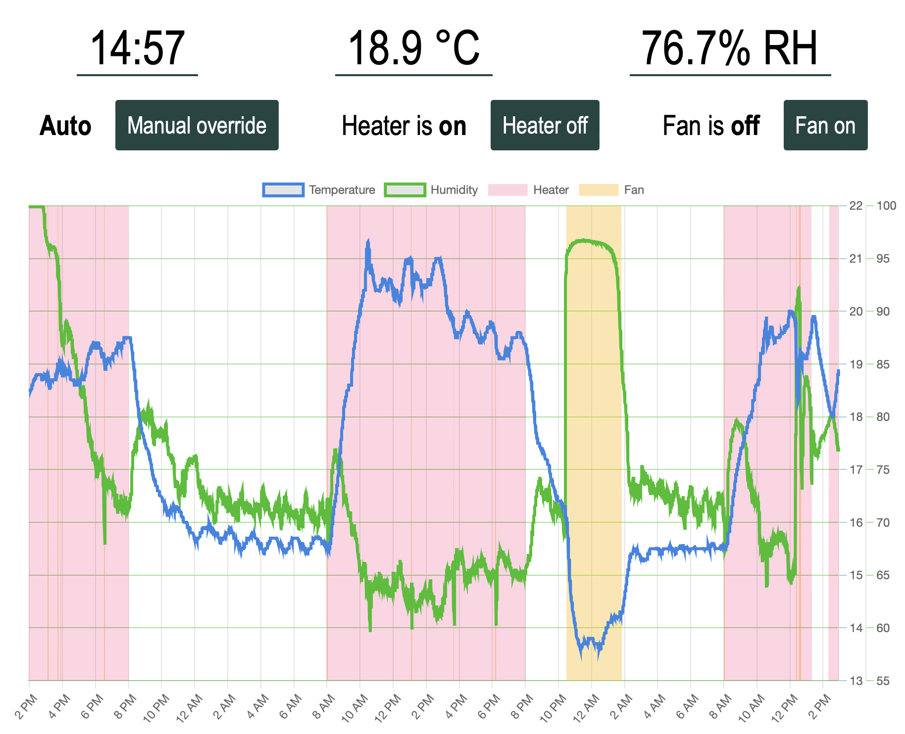

To monitor and control the terrarium, I built a simple web application with Flask. It displays the current status of the environment and the actuators, as well as a graph of the previous 48 hours.

I also built a less useful but still arguably useful phase diagram of these variables. Since there is a high degree of correlation between humidity and temperature, sometimes this reveals interesting patterns (like when the absolute moisture levels are higher, or the temperature recovery after ventilation.)

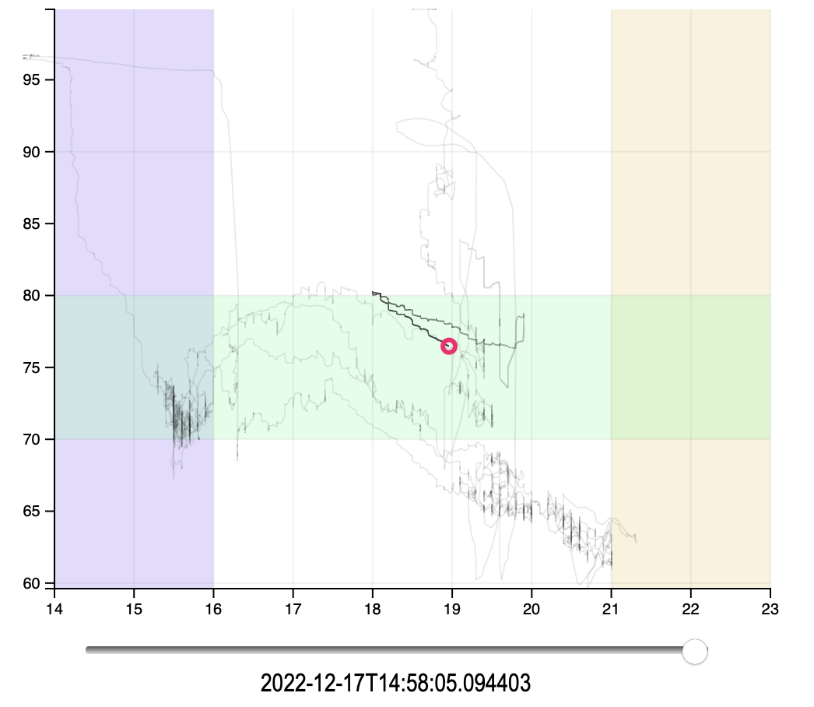

There's still a lot of room here to have some fun with D3 and other ways of visualizing patterns in this data.

### Other next steps 

Despite my modest intentions I found myself going farther than I anticipated. And yet, this is nothing. The obsession can go deep, as the existence of https://www.slippertalk.com/, an old school web forum for devoted fans of slipper orchids (including Paphs) attests.

This was a very iterative project. Once I had installed a temperature and humidity sensor, and could directly measure how inadequate the environment was, how could I let my precious flowers wither in such conditions?

And now that the temperature control is working so nicely, why not a mechanized way of increasing humidity?

To be continued.

